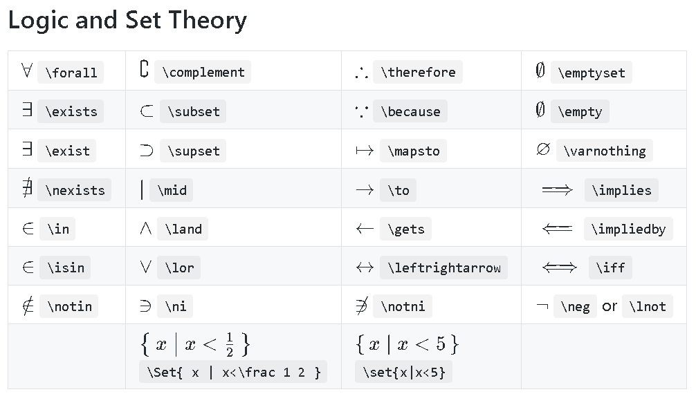

tags:: Algorithmics
topic:: [[Pseudocode]]
algo:: Unit 3 Outcome 2

-
- statements for handing decisions
- expressions evaluate to *true* or *false*
	- algorithms then execute statements based on these evaluations
- *control flow* is the process of using conditional expressions to make decisions about which statements to run in a program
- uses boolean algebra to define each expression through logical operators
	- **conjunction**
		- AND or $\land$
		- true if and only if all parts are true
		- for example, $A \land B$ is true if and only if $A$ AND $B$ are both individually true
	- **disjunction**
		- OR or $\lor$
		- true if either part is true
		- for example, $A \lor B$ is true if either $A$ OR $B$ is true
	- **negation**
		- NOT or $\lnot$
		- is an operation on one logical value
		- if $P$ is true then $\lnot P$ is false
		- $NOT\ P$ is true if $P$ is false
- 
- use parentheses to group parts of an expression together to make it more understandable
- use a truth table to help understand the result of more complex expression involving multiple logical statements
-
- Further Research
  background-color:: purple
	- Read
		- [Conditional (computer programming) - Wikipedia](https://en.wikipedia.org/wiki/Conditional_(computer_programming))
		- [Truth table - Wikipedia](https://en.wikipedia.org/wiki/Truth_table)
		- [Boolean algebra - Wikipedia](https://en.wikipedia.org/wiki/Boolean_algebra#Venn_diagrams)
		-
		-
	- Watch
		- {{video https://www.youtube.com/watch?v=q2eyZZK-OIk}}
		- {{video https://www.youtube.com/watch?v=7mulE-zramc&pp=ygUMdHJ1dGggdGFibGVz}}
		- {{video https://www.youtube.com/watch?v=F3544ZyO-eU}}
		- {{video https://www.youtube.com/watch?v=W7luvtXeQTA&pp=ygUSbG9naWNhbCBleHByZXNzaW9u}}