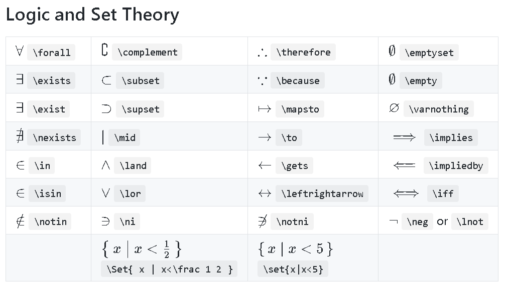

tags:: Algorithmics, Proof
topic:: [[Algorithm Design]]
algo:: Unit 3 Outcome 2

-
- the idea is that if the previous statement is true, it follows that the next statement in the sequence is also true
- if you want to prove that the algorithm works for any value of N you want to show that it works for  values $N_1, N_2, N_3.....N_k$
- this implies that if it works for $N_k$ it will also work for $N_{k+1}$ which is written using notation as $N_k \implies N_{k+1}$
- 
	- [Logic and Set Notation](https://katex.org/docs/supported#logic-and-set-theory)
- show that the algorithm works for a base case and then create a hypothesis stating that it will be assumed to hold for another case.
- using the base case and the proposition we then show that the algorithm works for the next case after our hypothesis, proving that the base case, our hypothesis and the next case of our algorithm work.
- the steps to perform a proof by induction are
	- Prove that the algorithm works for the base case (eg $n = 1$) by showing that the $LHS = RHS$
	  logseq.order-list-type:: number
	- Create the hypothesis with the assumption that the algorithm works for any $n$ with $n = k$
	  logseq.order-list-type:: number
	- Prove that the algorithm works with $n = k + 1$ showing that if we prove this using our assumption in step 2 the algorithm will continue to work for the next value of $n$ (note that $k + 1$ represents the next value of $n$, it could be different to this depending on the algorithm)
	  logseq.order-list-type:: number
	- Conclude the proof by stating that the algorithm works for $n=1$ and if it works for $n = k$ it also works for $n = k + 1$. Therefore it works for all values of $n \ge 1$
	  logseq.order-list-type:: number