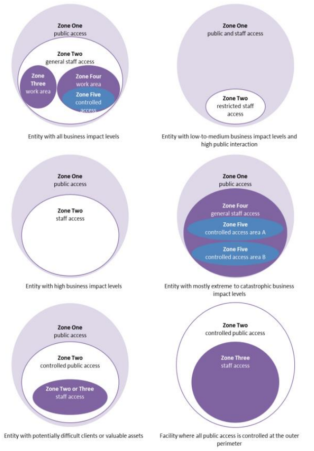

tags:: Software Development
topic:: [[Security Strategies]]
softdev:: Unit 4 Outcome 2

-
- minimise or remove the risks to people, information and assets
	- harm to people
	- access to information or resources without authorisation
- Physical Security Components (D3R2)
	- Deter
		- make it harder to access people and assets
	- Detect
		- identify unauthorised access
	- Delay
		- slow the progress of attacks to increase time for responses
	- Respond
		- once detected, implement measures to mitigate an attack or event
	- Recover
		- restore operations to normal as soon as possible after an event
- use zone layering for physical access, especially when public access is required
	- 
- Physical Security Controls
	- video surveillance
	- alarms
	- motion sensors
	- fences and phsycial barriers
	- security passes
	- biometric authentication
	- security guards and patrols
-
- Further Research
  background-color:: purple
	- Read
		- [Government Guidelines](https://www.cyber.gov.au/sites/default/files/2023-12/07.%20ISM%20-%20Guidelines%20for%20Physical%20Security%20%28December%202023%29.pdf)
		- [Physical security - Wikipedia](https://en.wikipedia.org/wiki/Physical_security)
	- Watch
		- {{video https://www.youtube.com/watch?v=kd33UVZhnAA&pp=ygURcGh5c2ljYWwgc2VjdXJpdHk%3D}}
		- {{video https://www.youtube.com/watch?v=pL9q2lOZ1Fw&pp=ygURcGh5c2ljYWwgc2VjdXJpdHk%3D}}